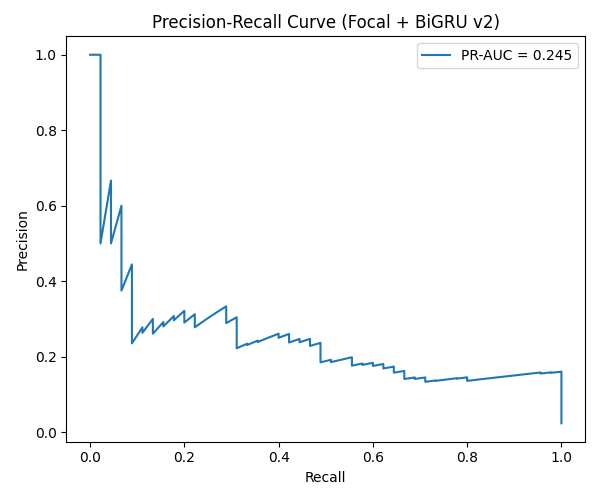

# Respiratory Sound Classification with a CNN–BiGRU

An exploratory classification project combining pooled acoustic features, numeric metadata, and a Keras convolutional/recurrent model. The repository documents preprocessing, class-imbalance handling, and the limits of interpreting a historical evaluation.

**Current demo:** a results browser backed by saved predictions. Live audio inference is unavailable because no matching trained checkpoint and preprocessing bundle are committed.



## Verified historical results

These values are recomputed from [the committed prediction CSV](output/crnn_model_results_5/test_predictions_f1opt_v2.csv), and agree with [the v2 report](output/crnn_model_results_5/report.ipynb). They describe the existing run, not a newly trained or independently validated model.

| Quantity | Value |
| --- | ---: |
| Prediction rows | 1,925 |
| Positive / negative labels | 45 / 1,880 |
| ROC-AUC | 0.9419 |
| PR-AUC, trapezoidal integration | 0.2454 |
| Positive-class precision | 0.2471 |
| Positive-class recall | 0.4667 |
| Positive-class F1 | 0.3231 |

The recorded confusion matrix is **TN 1,816 · FP 64 · FN 24 · TP 21**. PR-AUC here is the area under the interpolated precision–recall curve, not average precision. A high ROC-AUC alone does not convey the low precision of the positive predictions.

**Evaluation limitation:** `train_crnn_clean5.py` selects the F1-maximizing threshold using the same test labels subsequently reported in the classification summary. Those thresholded metrics are exploratory and optimistically selected, not an untouched held-out estimate. Prediction rows are not established as independent participants.

## Inspect or run the results browser

Recompute all aggregate metrics with Python 3.10+; no external packages, audio, or model are needed:

```sh
python scripts/summarize_results.py
python -m unittest discover -s tests -v
```

The [verified summary](output/crnn_model_results_5/verified_summary.json) includes the source CSV's SHA-256 digest for provenance.

For the interactive browser:

```sh
python -m venv .venv
source .venv/bin/activate
python -m pip install -r requirements.txt
streamlit run app.py
```

The app displays aggregate results and existing curves. It does not upload audio or participant information, and it does not make diagnostic predictions.

## Model and feature contract

The documented run is `coding/train_crnn_clean5.py`, with outputs under `output/crnn_model_results_5/` (the filenames call this **v2**). Its Keras model has two Conv1D blocks, a bidirectional GRU, and a sigmoid classifier; training uses focal loss, SMOTE, and class weights.

Feature extraction averages 13 MFCCs, 12 chroma features, and four spectral/time-domain summaries across each recording. The input-building script joins these 29 acoustic features with metadata. The training script selects **all numeric columns except the target**; the saved report records **49 inputs**. The convolution and GRU therefore operate along an ordered feature vector, not an acoustic time-frame sequence. An audio-only interpretation of the recorded result is not justified.

The old demo defined a different PyTorch architecture, expected `.pt` files, and supplied only 29 audio features. No verified V7 training source or checkpoint exists in the current tracked tree. That incompatible path and its unsupported static prediction have been removed. Renaming `.keras` to `.pt` is not a conversion.

For a trusted local checkpoint produced by the Keras training code:

```sh
python -m pip install -r requirements-training.txt
python scripts/test_model_load.py /path/to/best_crnn_focal_biGRU_v2.keras --features 49
```

This checks loading and tensor shapes using `compile=False`; it does not establish preprocessing compatibility or model accuracy. No checkpoint is bundled. Before restoring inference, export the exact feature order and fitted scaler with the matching model, decide how metadata inputs are obtained, and validate the complete pipeline. Do not derive replacement scaling statistics from a different dataset or silently substitute zeros for missing inputs.

## Reproduction scope and next experiment

The historical scripts now resolve project paths relative to their source files. Training dependencies are listed separately in `requirements-training.txt`; the original exact package versions, trained weights, and fitted scaler are not available. The raw-data pipeline has not been rerun in this update.

With authorized inputs, `python coding/train_crnn_clean5.py` reads `output/model_input_clean_train.csv` and `output/model_input_clean_test.csv` and writes into the historical results directory. **Back up existing evaluation artifacts before rerunning.** This entry point preserves the original experiment, including its methodological limitations; it is not the recommended design for a new evaluation.

A defensible new experiment should:

1. Define an explicit feature schema and audit numeric metadata for target proxies.
2. Split by participant before scaling, augmentation, or oversampling; verify participant separation across all partitions.
3. Fit preprocessing and SMOTE on training data only. The historical script oversamples before `validation_split`, so validation is not cleanly isolated from preprocessing.
4. Choose a threshold on validation data and evaluate once on untouched test data.
5. Export the model, fitted preprocessing, feature schema, split definition, seed, environment, and aggregate evaluation together.

These are requirements for a future run, not claims that the current artifacts meet them. The existing run does not establish clinical utility.

## Repository guide

| Location | Purpose |
| --- | --- |
| `coding/` | Historical preprocessing, feature generation, CNN/CRNN variants, and baseline experiments |
| `coding/train_crnn_clean5.py` | Source corresponding to the highlighted v2 artifacts |
| `output/crnn_model_results_4/` | Earlier saved curves and report |
| `output/crnn_model_results_5/` | Highlighted report, curves, predictions, and verified aggregate summary |
| `app.py` | Aggregate results browser |
| `scripts/` | Metric verification, explicit Keras shape check, and allowlisted release packaging |
| `tests/` | Metric, artifact, packaging, and missing-checkpoint checks |

The source dataset is identified in the original project as the [Corona Hack Respiratory Sound Dataset](https://www.kaggle.com/datasets/praveengovi/coronahack-respiratory-sound-dataset). Obtain data through its authorized distribution and follow its usage conditions. Do not commit private or restricted recordings, metadata, or uploads. Some metadata and derived tables were already tracked in this repository; adding ignore rules does not remove those historical files.

## Share a lightweight copy

```sh
bash scripts/make_shareable_release.sh respiratory-results-release.zip
```

The helper packages only explicitly allowlisted source files and the public v2 evaluation artifacts. It excludes dataset directories, participant metadata tables, local models, uploads, archives, and Git history; it refuses to overwrite an existing archive. The unused `junk_archive.tar.gz` was removed from the current tree and remains recoverable through Git history.
